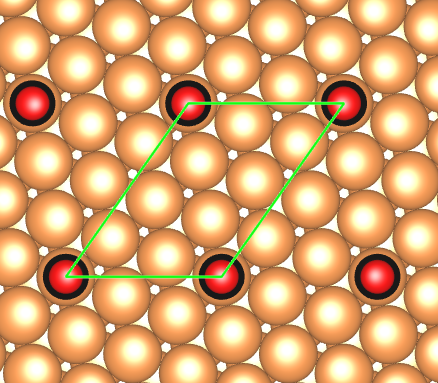

# :one: Introduction
---

**`dlePy`** is a small collection of python scripts used for creating, modifying atomic structures for computational simulations and for analysing results. 
Some of them were dated back in 2008. Originally, it is called **`dlescripts`**. Because I did not intend to make it user-friendly for publishing, it was/is not very clean and readable.

I am starting to clean the code, document it and publish one by one.

Contact:
```
Duy Le
Department of Physics
University of Central Florida
```
:e-mail: duy.le ~at~ ucf.edu
Website: [http://www.physics.ufc.edu/~dle](http://www.physics.ufc.edu/~dle)

# :two: Requirements
---

* python (> 2.7 but it should work with any version)
* atomic simulation environment ( > 3.15, but it should work with any version )
* matlotlib and scipy

# :three: Installation
---

* Step 1:
```
git clone https://github.com/zoowe/dlePy.git
```
* Step 2:
Add the path to **`dlePy`** folder to $PYTHONPATH environment.
There are many ways to accomplish this. Here is an example.
```
export $PYTHONPATH=Path_to_dlePy:$PYTHONPATH
```

# :four: Instruction
---

As I continue to clean codes, I will start to write instruction/manual.
For now, please refer to examples.

## Structure creations and manipulations
### :large_blue_diamond: [strucmod.py](strucmod.py)
#### rotate_group( atoms, group, axis, angle, center )
Rotate a group of atoms ( list indices ) around `axis` and `center` by `angle` degree
#### translate_group( atoms, group, dir )
Translate a group of atoms along `dir` direction.
#### sort_group( atoms, indices = [ ], symbols = [ ] )
Sorting a group of atoms, i.e.  adsorbates. List of atoms can be specified by `indices` or `symbols`

##### [Example](examples/sort_group.py)
```python
from ase.build import molecule, fcc111, add_adsorbate
from ase.io import write
from dlePy.strucmod import sort_group

slab = fcc111('Al', size=(2,2,3), vacuum=7.5)
mol  = molecule( 'H2O' )

add_adsorbate(slab, mol , 1.5, 'ontop')
add_adsorbate(slab, mol , 2.0, 'bridge')

indices = [ atom.index for atom in slab if atom.symbol in ['H', 'O'] ]
slab_sort_group_indices = sort_group( slab, indices = indices  )
slab_sort_group_symbols = sort_group( slab, symbols = [ 'H', 'O' ]  )

# Write diffent POSCAR files for the same system with different sort options.
write('POSCAR.no_sort', slab, format='vasp', vasp5 = True, direct = True, sort = False )
write('POSCAR.sorted',  slab, format='vasp', vasp5 = True, direct = True, sort = True )
write('POSCAR.sort_group_indices', slab_sort_group_indices, format='vasp', 
       vasp5 = True, direct = True, sort = False )
write('POSCAR.sort_group_symbols', slab_sort_group_symbols, format='vasp', 
       vasp5 = True, direct = True, sort = False )
```

### :large_blue_diamond: [supercell.py](supercell.py)
#### supercell( atoms, n0, n1, n2 )
Create a supercell from primitive cell `atoms`.
This method is better than the traditional way `atoms * ( n0, n1, n2 )` because it keeps the order of atoms.
#### remove_atoms_outside( atoms, shift = 0., threshold = 0.01 )
Remove atoms outside supercell. If you create a new supercell inside a current one, which is larger, it wil remove all atoms outside the new supercell.
#### create_matrix_surface( atoms, matrix = ( 1, 0, 0, 1 ), pad=1, shift = 0.01, threshold = 0.01 )
Create a surface from primitive one `atoms` using matrix notation

```
| m1  n1 |
| m2  n2 |

maxtrix = ( m1, n1, m2, n2 )
```
##### [Example](examples/matrix_surface.py)
( 2, 1, -1, 4) CO overlayer on Cu(111)
```python
from ase.build       import molecule, fcc111, add_adsorbate
from dlePy.supercell import create_matrix_surface
from ase.visualize   import view

primitive = fcc111( 'Cu', size = ( 1, 1, 5 ), vacuum = 7.5 )
surface   = create_matrix_surface( primitive, matrix = ( 2, 1, -1, 4 ) )
mol       = molecule( 'CO' )
add_adsorbate( surface, mol, 1.5, position = ( 0., 0. ), mol_index = 1 )

view( surface )
```


### :large_blue_diamond: [vasp/chgcar.py](vasp/chgcar.py)
#### read_chgcar(INDATA, CONTCAR='CONTCAR')
Read `CHGCAR` format file. INDATA: Filename

#### write_chgcar( fobj, atoms, data = None)
Write 3D `data` array to `fobj` file, using `CHGCAR` format,  with atomic structure from `atoms`

#### reduce_chgcar( INDATA, factor, CONTCAR = 'CONTCAR' )
Reduce `CHGCAR` format file named `INDATA` by `factor`. It is helpful to reduce `CHGCAR` file to transfer and visualize.
##### [Example](examples/reduce_chgcar.py)
```python
from dlePy.vasp.chgcar import reduce_chgcar

INDATA = 'CHGCAR'        # CHGCAR or PARCHG...
struc_file = 'CONTCAR'   # POSCAR, CONTCAR
factor = 3               # If = 1, no reduction
                         # Use this option for faster plotting

reduce_chgcar( INDATA, factor, CONTCAR=struc_file)
```

### reduce_spin_chgcar(INDATA, factor,CONTCAR='CONTCAR')
Same as `reduce_chgcar` but for spin-polarized `CHGCAR`.
#### [Example](examples/split_spin.py)
```python
from dlePy.vasp.chgcar import reduce_spin_chgcar

INDATA = 'CHGCAR'        # CHGCAR or PARCHG...
struc_file = 'CONTCAR'   # POSCAR, CONTCAR
factor = 4               # If = 1, no reduction
                         # Use this option for faster plotting

reduce_spin_chgcar( INDATA, factor, CONTCAR = struc_file )
```

### :large_blue_diamond: [vasp/kpoints.py](vasp/kpoints.py)
Coming soon

### :large_blue_diamond: Partial Density of States
Coming soon

### :large_blue_diamond: Electronic Band Structure
Coming soon

### :large_blue_diamond: Scanning Tunneling Microscope
Coming soon

### :large_blue_diamond: [Quantum ESPRESSO input](qe/pwscf.py)
Generate input for Quantum ESPRESSO run
#### [Example](examples/make_pwscf_input.py)
This example shows how to generate input, add/remove keyworks...
```python
import numpy as np
from ase import Atoms
from ase.build.surface import fcc111
from ase.constraints import FixAtoms
from dlePy.qe.pwscf import PWscfInput, write_pwscf_input

# Generate 5 layer of (1x1) Cu(111) in a 20 angstrom vacuum
system = fcc111( 'Cu', size = (1,1,5), a = 3.16, vacuum = 10.)

# Fix bottom 3 layer
indices = [ a.index for a in system \
            if a.position[ 2 ] < 0.51 * system.cell[ 2, 2 ] ]
system.set_constraint ( FixAtoms ( indices = indices ) )
pwscf = PWscfInput ( system )

# Set pseudo_dir
pwscf.control.settings.pseudo_dir = '/home/PS_LIBRARY'

# Set high disk_io
pwscf.control.io.disk_io = 'high'

# set non spinpolarize
pwscf.system.spin_pol.nspin = 1

# Do not need it if nspin = 1. This is how to set starting_magnetization
pwscf.starting_magnetization.starting_magnetization[0] = 1.

# Set mass and pseudo potential file for each type
pwscf.atomic_species.mass[0] = 63.546
pwscf.atomic_species.pseudo_potential[0] = 'Cu.pbe-n-nc.UPF'

# Set k-point mesh. Only automatic 
pwscf.kpoints.nk = [ 3 , 3 , 1]
pwscf.kpoints.sk = [ 0 , 0 , 0]


write_pwscf_input ( pwscf , 'input.inp' )

# set more input
setattr ( pwscf.ions , 'upscale', 100.0 )
write_pwscf_input ( pwscf , 'input.1.inp' )

# remove some setting
del  pwscf.ions.upscale
del  pwscf.control.ion_relax.tstress
write_pwscf_input ( pwscf , 'input.2.inp' )

# change default setting
setattr ( pwscf.electrons , 'mixing_beta', 0.2 )
write_pwscf_input ( pwscf , 'input.3.inp' )
```
