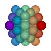
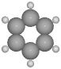
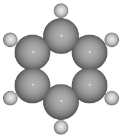
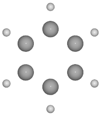
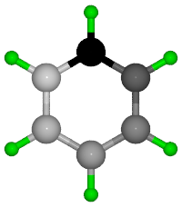
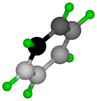
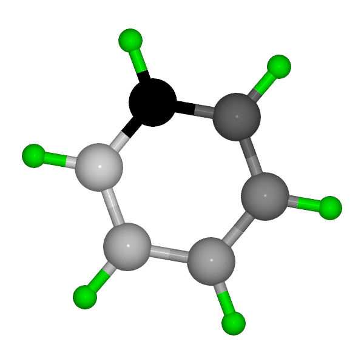

# Figures with ASE, Povray, ImageMagick

## :one: Purposes
- Making graphic with ASE, Povray amd movie with ImageMagick

## :two: Hows

### Software needed
- Atomic simulation environment
- Povray
- ImageMagick

Before starting, load the modules:
```
module load ase
module load povray
module load ImageMagick
```

### Learn from examples

#### There are 6 python codes to make image for benzene molecule (first_image.py to sixth_image.py). Check each of them, from the first to 6th image.
- first_image.py: Simplest code.


- second_image.py: Change resolution.

Keyword: `canvas_width` (or `canvas_height`)


- third_image.py: Change radii of atoms

Keyword: `radii`. Radii of all atoms can be specified in a 1-D array.



- fourth_image.py: Display bonds

Keyword: `bondatoms = bond_pairs`.

To get `bond_pairs`
```python
from ase.io.pov import get_bondpairs
bond_pairs = get_bondpairs( benzene, radius = 1.1 )
```


- fifth_image.py: change color of atoms.

Keyword: `colors = colors`

`colors` can be a tuple or a list each element of which must be a tuple with 3 or 4 elements. The first 3 elements are RGB code, the 4th one determines the transparency (0 to 1).



- sixth_image.py: add rotations to image

Keyword: `rotation = '90x,-30y,45z,-30x'`



#### movie.py: Rotation of a benzene molecule



#### demo.py: Rotation of an Icosahedron nanoparticle


## :three: Useful commands 

- `python code.py`: run a python code.
- `o image.png`: view an image.
- `animate movie.gif`: view a gif movie 
